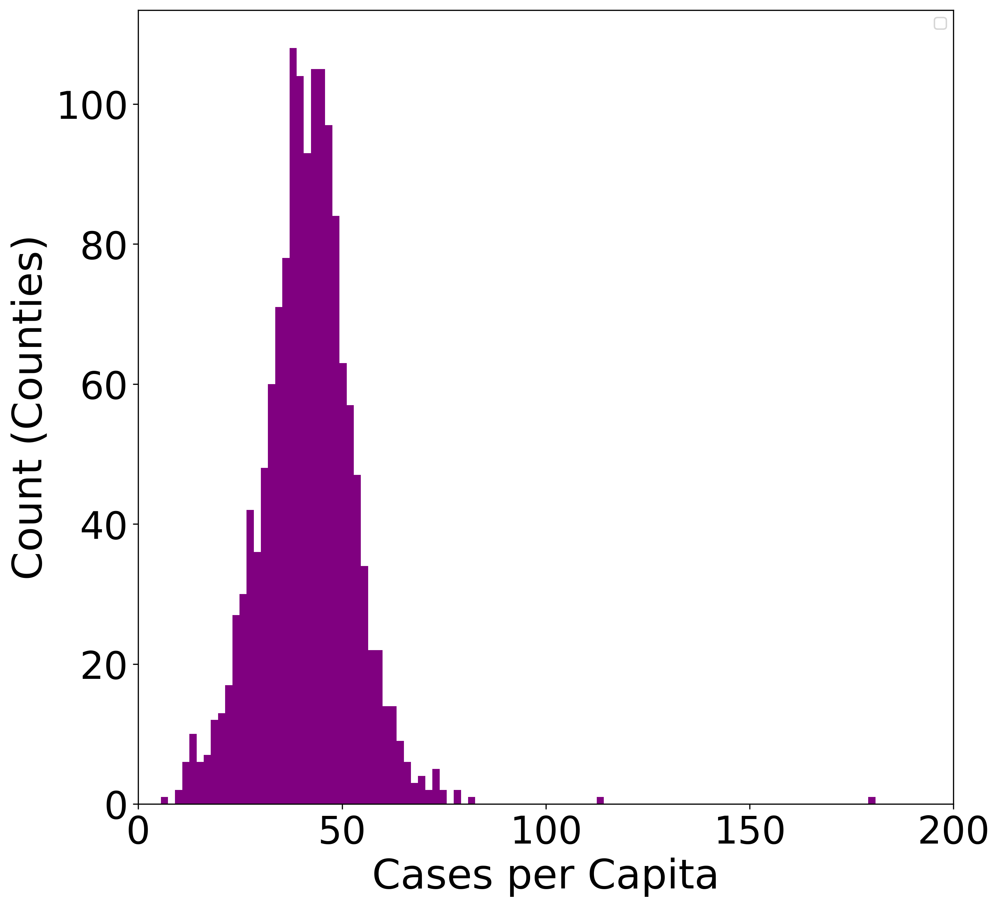

# ChE 2410 Project 1 - COVID Factors: How transportation usage and population density affect covid infection rates.

Abstract: in 2021 Americans slowly started using public transportation again after the dropoff during the early COVID period. Given apparent shared space occuring in public transportation, was the rate of public transportation usage a factor in COVID case rates in 2021? This data analysis looks into answering this question using existing public datasets to generate vizualizations of what relationships may exist between different measurements of American counties. 

No significant relationship was found between whether a county had significant public transportation usage and their according case count in 2021. Future observations should look into more specific slices such as particular metropolitan areas or specific time periods.

This is a histogram of total cases per capita. Further outliers are omitted with even higher total case counts. Total cases per capita is across a year, corresponding average cases per capita would be the total divided by number of reported cases, 365.

Log10 of public transportation usage versus cases per capita, one dot is a county. Colored based on log10 of population density.
